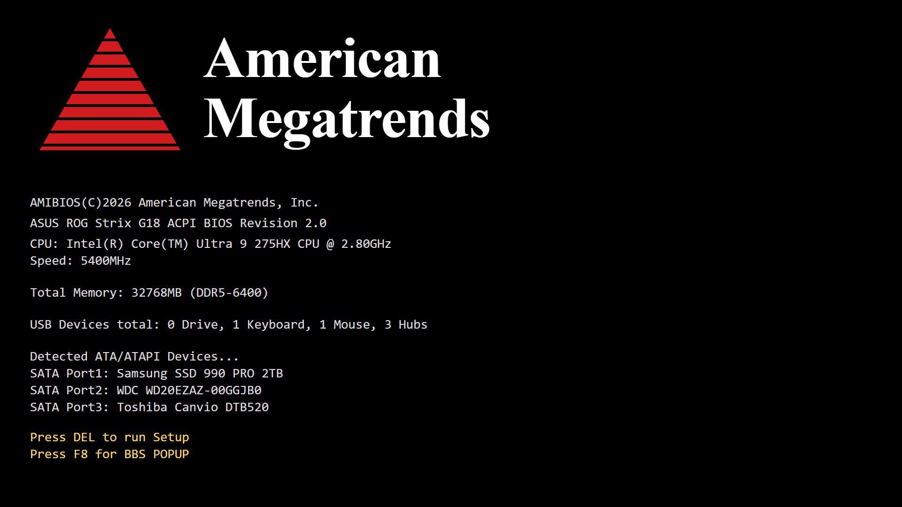

<!-- ════════════════════════════════════════════════════════════════ -->
<!--  dwgx.menu  v2.0                                                 -->
<!-- ════════════════════════════════════════════════════════════════ -->



<div align="center">


<br/>

[](https://dwgx.github.io)

<p>
  
  &nbsp;
  
  &nbsp;
  
</p>

</div>

---

### `main.cfg`

```ini
; dwgx.cfg  —  last modified 2026-04-21 JST
; injection status: active  ·  process.count: 10

[identity]
alias      = dwgx · 帝王尬笑
location   = Kobe, Hyogo · JST+9
motto      = be water
bio        = 也许我就是dwgx

[role]
primary    = independent-developer
origin     = Minecraft cheat scene
focus      = reverse-engineering, game-hacking, systems, backend, ai-tooling
anti-focus = normal-human-activity

[languages]
active     = java · cpp · csharp · swift · typescript · python · go
previous   = js · php
```

---

### `process.table`

```
 PID    MODULE                   ADDR             LANG    STATUS
 ──────────────────────────────────────────────────────────────────────────────
 0001   vrchat-il2cpp-re         0x7FF6A4010000   c#      ▓▓▓▓▓▓▓▓▓░  97.7% deobf
 0002   VRCSM                    0x7FF6A40AB000   ts      ▓▓▓▓▓▓▓░░░  cache.mgr
 0003   WindsurfAPI              0x7FF6A40FF000   js      LISTENING  :8080  ★199
 0004   skiapi-frontend          0x7FF6A4180000   js      ADMIN-UI  MUI.console
 0005   RepoDLL                  0x7FF6A4220000   cpp     HOOKED  Present()  ★10
 0006   Rep0S2cLeak              0x7FF6A42D0000   c#      LEAKED  src.dumped
 0007   Lavender-rise-main       0x7FF6A4350000   java    MC-1.21  cheat-client
 0008   OpenNative               0x7FF6A4400000   cpp     NATIVE-HOOK  dx11.vtbl
 0009   flipper-custom-apps      0x7FF6A4480000   c       ESP32-BOOST  ble-spam
 0010   FlipperZeroTeacher       0x7FF6A4520000   html    雙語教學.知識庫
```

---

<div align="center">

### `pinned`

<table>
<tr>
<td width="33%" valign="top">

```
╔════════════════════════╗
║ vrchat-il2cpp-re       ║
╠════════════════════════╣
║                        ║
║ 42,000 classes         ║
║ 97.7% deobfuscated     ║
║ Photon protocol RE     ║
║                        ║
║ lang  · C#             ║
║ stage · live           ║
║ diff  · ★★★★☆          ║
╚════════════════════════╝
```

[open module →](https://github.com/dwgx/vrchat-il2cpp-re)

</td>
<td width="33%" valign="top">

```
╔════════════════════════╗
║ VRCSM                  ║
╠════════════════════════╣
║                        ║
║ VRChat cache / config  ║
║ Windows desktop app    ║
║ C++20 + WebView2 + TS  ║
║                        ║
║ lang  · TypeScript     ║
║ stage · active-dev     ║
║ diff  · ★★★☆☆          ║
╚════════════════════════╝
```

[open module →](https://github.com/dwgx/VRCSM)

</td>
<td width="33%" valign="top">

```
╔════════════════════════╗
║ WindsurfAPI            ║
╠════════════════════════╣
║                        ║
║ Windsurf ⇄ OpenAI      ║
║ 59+ free models        ║
║ load-balancing proxy   ║
║                        ║
║ lang  · JavaScript     ║
║ stage · popular  ★199  ║
║ diff  · ★★☆☆☆          ║
╚════════════════════════╝
```

[open module →](https://github.com/dwgx/WindsurfAPI)

</td>
</tr>
</table>

</div>

---

### `recent.log`

```
 2026-04-20 11:27   push  WindsurfAPI           ★199   js     windsurf ⇄ openai proxy
 2026-04-19 13:19   push  VRCSM                 ★1     ts     vrchat cache/settings manager
 2026-04-16 13:50   push  vrchat-il2cpp-re      ★1     c#     97.7% deobf · 42k classes
 2026-04-15 10:44   push  RepoDLL               ★10    cpp    dx11+imgui · mono reflection
 2026-04-19 13:23   push  cs2-walkbot-ext       ★1     c      windmouse+fitts · imgui overlay
 2026-04-16 06:56   push  blender-copilot       ★1     py     blender mcp · 70+ tools
 2026-04-20 11:22   push  VRC-Auto-Uploader     ★1     py     unity batchmode · avatar pipeline
 2026-04-20 11:24   push  flipper-custom-apps   ★1     c      ble-spam + esp32 dual-radio
 2026-04-15 10:44   push  YuKiKo                ★19    py     skiapi backend engine
 2026-04-15 10:44   push  Wechathacker          ★2     -      wxid binary-search tool
```

<details>
<summary><code>archive.log  — +14 older entries</code></summary>

```
 2026-04-20 11:26   push  Live2DPet             ★1     js     ai live2d + voicevox pet
 2026-04-20 11:26   push  claude-gemini-subagent ★1    sh     claude-code subagent bridge
 2026-04-15 10:52   push  claude-codex-subagent ★1     sh     claude→codex worker subagent
 2026-04-15 10:53   push  FlipperZeroTeacher    ★1     html   flipper 雙語教學知識庫
 2026-04-15 10:52   push  dev-history           ★1     -      項目檔案 · 開發日曆
 2026-04-15 10:52   push  blog                  ★1     md     personal markdown blog
 2026-04-18 12:52   push  dwgx.github.io        ★1     html   personal site
 2026-04-15 11:34   push  skiapi-frontend       ★1     js     newapi admin console · MUI
 2026-04-10 09:18   push  strict                ★1     java   minecraft 1.21.3 anti-cheat
 2026-04-10 09:17   push  CleanerKing           ★1     java   host-machine accelerator
 2026-04-10 09:16   push  darkpixel             ★1     java   1.21.4 paper-plugin
 2026-03-21 11:50   push  Rep0S2cLeak           ★1     c#     repo leaked src
 2026-03-21 11:50   push  ToolBox               ★2     py     good toolbox
 2026-03-08 23:18   push  QQbot                 ★1     py     tencent bot python lib
```

</details>

---

### `hardware.dmp`

```
               ╭─── dwgx@kobe ──────────────────────────────────╮
               │                                                │
 ROG Strix ════╡  host       ASUS ROG Strix G18  (primary)      │
               │  cpu        Intel Ultra 9 275HX                │
               │  gpu        NVIDIA RTX 5070 Ti                 │
               │  mem        32 GB DDR5                         │
               │  disp       18"  2.5K                          │
               │                                                │
 Desktop ══════╡  gpu        Colorful iGame RTX 3060 Ultra      │
               │  mem        16 GB DDR4 3200                    │
               │                                                │
 MacBook ══════╡  host       MacBook Air M2 · A2681             │
               │  mem        8 GB · 256 GB SSD · 13.6" Retina   │
               │                                                │
 Mobile ═══════╡  phone      iPhone 17 · 256GB · JP-region      │
               │  phone-2    Redmi K60 · 512GB                  │
               │  wear       Apple Watch 1st · Stainless · 2015 │
               │                                                │
 Peripheral ═══╡  kbd        VGN FLASH Ultra 太陽神 · mag-switch │
               │  mouse      VGN Dragonfly 3 Master 超跑紅 · 56g │
               │  audio      AirPods Pro 3 · Panasonic SL-CT790 │
               │  vr         Meta Quest 3                       │
               │                                                │
               │  uptime     5768 days                          │
               │  status     online · JST+9                     │
               ╰────────────────────────────────────────────────╯
```

---

<div align="center">

### `discord.presence`

<a href="https://discord.com/users/1284670281926967336">
  
</a>

---

### `featured`

## 幻想万華鏡 ~ The Memories of Phantasm


<br/>

<sub>滿福神社製作  ·  全18話  ·  BDRip  ·  東方Project 二次創作</sub>

<br/><br/>


</div>

---

<!-- ════════════════════════════════════════════════════════════════ -->
<!--  style switch: scene-nfo release note                            -->
<!-- ════════════════════════════════════════════════════════════════ -->

. d w g x . p r e s e n t s .

dwgx.menu · v2.1 · 2026  
scene release // kobe, jp // solo crew

**group** — dwgx  
**location** — kobe · jp · jst+9  
**release** — personal-profile.v2.1  
**files** — 1 readme.md + 2 assets  
**size** — ≈ 1.8 mb (gif-heavy)  
**target** — github.com/dwgx  
**born** — 20100705  
**date** — 2026.04.21

<div align="center">

### `▓▒░  [ stack.manifest ]  ░▒▓`


</div>

<table align="center" width="100%">
<tr>
  <td align="right" width="110"><code><b>jvm</b></code></td>
  <td>
    
    
    
  </td>
</tr>
<tr>
  <td align="right"><code><b>native</b></code></td>
  <td>
    
    
    
    
    
  </td>
</tr>
<tr>
  <td align="right"><code><b>managed</b></code></td>
  <td>
    
    
    
    
    
  </td>
</tr>
<tr>
  <td align="right"><code><b>reverse</b></code></td>
  <td>
    
    
    
    
    
    
  </td>
</tr>
<tr>
  <td align="right"><code><b>ai</b></code></td>
  <td>
    
    
    
    
    
    
  </td>
</tr>
<tr>
  <td align="right"><code><b>hardware</b></code></td>
  <td>
    
    
    
  </td>
</tr>
<tr>
  <td align="right"><code><b>backend</b></code></td>
  <td>
    
    
    
    
    
    
  </td>
</tr>
<tr>
  <td align="right"><code><b>archive</b></code></td>
  <td>
    
    
    
  </td>
</tr>
</table>

. s h o u t o u t s .

to every anon who kept pushing commits with zero stars and zero watchers  
to every kid who built something just to see if it could be done

— dwgx, kobe

---

### `stats`

<div align="center">

<picture>
  <source media="(prefers-color-scheme: dark)" srcset="https://github-readme-stats-sigma-five.vercel.app/api?username=DWGX&show_icons=true&hide_border=true&bg_color=06020f&title_color=f2a6c4&icon_color=c9a84c&text_color=d4c8ef&ring_color=f2a6c4" />
  
</picture>
&nbsp;&nbsp;
<picture>
  <source media="(prefers-color-scheme: dark)" srcset="https://streak-stats.demolab.com/?user=DWGX&hide_border=true&background=06020F&stroke=2d1b69&ring=f2a6c4&fire=c9a84c&currStreakLabel=f2a6c4&sideLabels=d4c8ef&currStreakNum=d4c8ef&sideNums=d4c8ef&dates=8a7aaa" />
  
</picture>

<br/>

<picture>
  <source media="(prefers-color-scheme: dark)" srcset="https://github-readme-stats-sigma-five.vercel.app/api/top-langs/?username=DWGX&layout=compact&hide_border=true&bg_color=06020f&title_color=f2a6c4&text_color=d4c8ef" />
  
</picture>
&nbsp;&nbsp;
<picture>
  <source media="(prefers-color-scheme: dark)" srcset="https://github-profile-summary-cards.vercel.app/api/cards/productive-time?username=DWGX&theme=github_dark&utcOffset=9" />
  
</picture>

</div>

---

### `achievements`

<div align="center">


<br/>


<br/><br/>


</div>

---

### `3d.contrib`

<div align="center">

<picture>
  <source media="(prefers-color-scheme: dark)" srcset="https://raw.githubusercontent.com/dwgx/DWGX/main/profile-3d-contrib/profile-night-rainbow.svg" />
  <source media="(prefers-color-scheme: light)" srcset="https://raw.githubusercontent.com/dwgx/DWGX/main/profile-3d-contrib/profile-season.svg" />
  
</picture>

</div>

---

### `summary.cards`

<div align="center">

<picture>
  <source media="(prefers-color-scheme: dark)" srcset="https://github-profile-summary-cards.vercel.app/api/cards/profile-details?username=DWGX&theme=nord_dark" />
  
</picture>
&nbsp;
<picture>
  <source media="(prefers-color-scheme: dark)" srcset="https://github-profile-summary-cards.vercel.app/api/cards/stats?username=DWGX&theme=nord_dark" />
  
</picture>

<br/>

<picture>
  <source media="(prefers-color-scheme: dark)" srcset="https://github-profile-summary-cards.vercel.app/api/cards/repos-per-language?username=DWGX&theme=nord_dark&exclude=html,css" />
  
</picture>
&nbsp;
<picture>
  <source media="(prefers-color-scheme: dark)" srcset="https://github-profile-summary-cards.vercel.app/api/cards/most-commit-language?username=DWGX&theme=nord_dark" />
  
</picture>

</div>

---

### `contribution.snake`

<div align="center">

<picture>
  <source media="(prefers-color-scheme: dark)" srcset="https://raw.githubusercontent.com/dwgx/DWGX/output/github-contribution-grid-snake-dark.svg" />
  <source media="(prefers-color-scheme: light)" srcset="https://raw.githubusercontent.com/dwgx/DWGX/output/github-contribution-grid-snake.svg" />
  
</picture>

</div>

---

<!-- ════════════════════════════════════════════════════════════════ -->
<!--  ledger — quote / motto fragment                                 -->
<!-- ════════════════════════════════════════════════════════════════ -->

<div align="center">

```
    ╭───────────────────────────────────────────────────────────╮
    │                                                           │
    │                   be   water   my   friend.               │
    │                                                           │
    ╰───────────────────────────────────────────────────────────╯
```

</div>

---

### `hex.dump`

```
 00401000  e5 b8 9d e7 8e 8b e5 b0   ac e7 ac 91 00 00 00 00   帝王尬笑........
 00401010  64 77 67 78 40 6b 6f 62   65 3a 7e 24 00 00 00 00   dwgx@kobe:~$....
 00401020  62 65 20 77 61 74 65 72   2c 20 6d 79 20 66 72 69   be water, my fri
 00401030  2f 68 6f 6d 65 2f 6b 6f   62 65 2f 2e 64 77 67 78   /home/kobe/.dwgx
 00401040  2f 70 65 72 73 6f 6e 61   2e 64 61 74 00 00 00 00   /persona.dat....
 00401050  69 6e 64 65 70 20 64 65   76 20 2f 2f 20 31 35 79   indep dev // 15y
```

---

### `hotkeys`

<div align="center">

<kbd>F1</kbd> [dwgx.github.io](https://dwgx.github.io)
&nbsp;&nbsp;·&nbsp;&nbsp;
<kbd>F2</kbd> [YouTube](https://www.youtube.com/@dwgx1337)
&nbsp;&nbsp;·&nbsp;&nbsp;
<kbd>F3</kbd> [Bilibili](https://space.bilibili.com/1452905012)
&nbsp;&nbsp;·&nbsp;&nbsp;
<kbd>F4</kbd> [QQ](https://user.qzone.qq.com/136666451/)

</div>

---

<div align="center">


</div>

```
 ─── dwgx@kobe ── JST+9 ── mode: archive ── uptime 5768d ── be water ───
```


